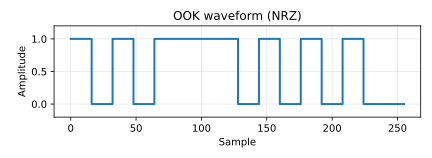
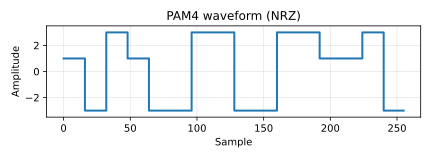
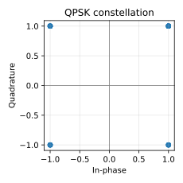

# fiber-link-sim

Physics-first simulator core for fiber‑optic communication links.
This repository provides the deterministic physics engine and stable `SimulationSpec → SimulationResult`
contract used by upstream orchestration/UI layers.

## What this project is

* **Physics core only**: Implements the link physics and signal processing pipeline; external tools
  orchestrate runs, sweeps, and visualization.
* **Stable contracts**: JSON Schema + Pydantic models define the public input/output API and are
  versioned to prevent breaking changes.
* **Deterministic**: Same spec + same seed → same results (within floating-point tolerances).
* **Modular pipeline**: Staged chain (Tx → Channel → Rx Front-End → DSP → FEC → Metrics) to keep
  blocks swappable without changing spec shape.

## Who should use this repo

* Researchers validating **link budgets, impairments, and DSP behavior** in a reproducible way.
* Tooling teams integrating a **SimulationSpec/SimulationResult** API into orchestrators or UIs.
* Developers who need a **deterministic, modular physics backend** without owning the full DSP stack.

## High-level architecture

1. **SimulationSpec** is validated (Pydantic + JSON Schema).
2. **Sequential pipeline** runs the configured stages with deterministic RNG.
3. **SimulationResult** is produced and validated against the result model.

Key references for deeper details live in:

* `docs/refs/physics_context.md`
* `docs/refs/phys_pipeline_usage.md`
* `src/fiber_link_sim/schema/README.md`
* `docs/stages_and_flags.md`
* `docs/waveform_examples.md`
* `docs/hft_latency_demo.md`

## Waveform examples

Visuals help anchor what the simulator models. Here are quick-look waveforms and a constellation
example drawn from deterministic example symbol streams:





## QPSK long-haul story (stage-by-stage)

Generate a deterministic, stage-by-stage artifact story for coherent QPSK long-haul:

```bash
python scripts/generate_qpsk_story.py \
  --spec src/fiber_link_sim/schema/examples/qpsk_longhaul_multispan.json
```

Artifacts are generated locally under `docs/assets/qpsk_story/<run_id>/` (and copied to
`docs/assets/qpsk_story/latest/` by default). See the manifest JSON for file paths.

## Validation & baselines

Validation combines analytic baselines and regression coverage:

* **Analytic**: QPSK BER closed-form check and propagation latency formula (`tests/analytic/`).
* **Regression**: QPSK story manifest structure and artifact presence (`tests/regression/`).
* **Integration**: end-to-end example specs remain validated under deterministic seeds.

## How this differs from OptiCommPy

OptiCommPy provides the underlying physics and DSP building blocks. This repo focuses on the
integration gap between those primitives and a repeatable, end-to-end link simulation. In
practice, it provides:

* **A stable contract** (`SimulationSpec → SimulationResult`) for external orchestration tools.
* **Deterministic, pipeline-based composition** so stages can be swapped without changing the spec.
* **Cross-stage metadata, provenance, and artifacts** to make runs reproducible and traceable.
* **Plain-language documentation** of stages and flags so the stack is transparent, not a black box.

In short: OptiCommPy is the physics toolkit; this repo is the deterministic, versioned simulator
core that wires those blocks into a repeatable end-to-end link model.

## Quick start (developer)

```bash
python -m pip install -e ".[dev]"
```

Run a simulation in your own tooling by importing `simulate()` and passing a spec dict or path.
See `src/fiber_link_sim/schema/examples/` for canonical spec examples.

## Installation

```bash
pip install -e .
```


## Benchmark simulation speed

Use the benchmark helper for both general runtime tracking and phys-pipeline execution profiling:

```bash
python scripts/benchmark_simulate.py --mode general --repeat 3
python scripts/benchmark_simulate.py --mode phys-pipeline --repeat 3
```

See `docs/benchmarking.md` for full benchmark modes, output fields, and example commands.

## Testing

Fast tests (default in pytest config):

```bash
pytest -m "not slow" --durations=10 --cov=fiber_link_sim --cov-report=term-missing:skip-covered
```

Slow tests only:

```bash
pytest -m slow --durations=10
```

Full suite (override defaults if you need slow tests included):

```bash
pytest
```

Note: pytest defaults to `-m "not slow" --durations=10`. To include slow tests in the full
suite, run `pytest -m "slow or not slow" --durations=10`.

Coverage (fast suite only):

```bash
pytest -m "not slow" --durations=10 --cov=fiber_link_sim --cov-report=term-missing:skip-covered
```
